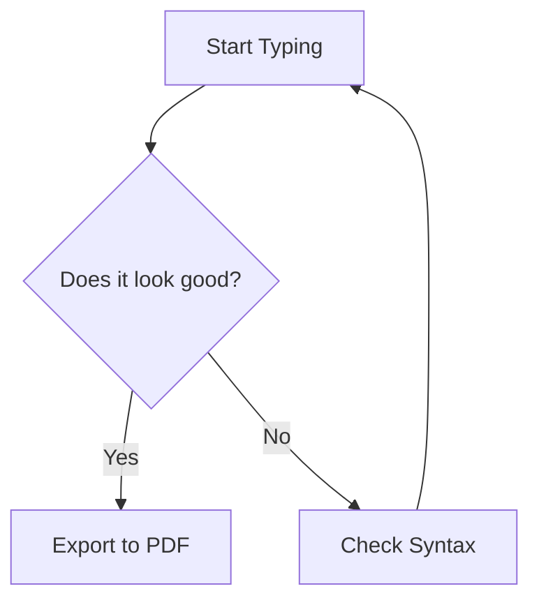

# Markdown Converter


Markdown Converter is a locally running browser extension that provides live Markdown preview, HTML/PDF export, PNG screenshots, Mermaid diagram rendering, and KaTeX math rendering for Chrome and Firefox.

## Install

[](https://play.google.com/store/apps/details?id=com.tiptinker.markdownconverter&hl=en)
[](https://apps.apple.com/us/app/mdconverter/id6764042576)
[](https://addons.mozilla.org/en-US/firefox/addon/markdown-converter-tiptinker/)
[](https://chromewebstore.google.com/detail/markdown-converter/dpgapbpmmacapacfjjdjhmbgpfdkbnli)

## Features

- Live Markdown preview
- GitHub Flavored Markdown support
- Mermaid diagrams and KaTeX math
- HTML export, PDF export, and PNG screenshots
- Light and dark themes
- Local autosave
- One repository, two build outputs: `dist/chrome` and `dist/firefox`

| | | |
|---|---|---|
|  |  |  |

Chrome and Firefox both use a single side panel/sidebar UI. Clicking the toolbar icon opens that panel.

## Quick Start

### Build

```bash
npm run build
```

Other commands:

```bash
npm run build:chrome
npm run build:firefox
npm run clean
```

### Package for Distribution

After `npm install`, package both browser builds with one command:

```bash
npm run package
```

Package only Chrome:

```bash
npm run package:chrome
```

Package only Firefox:

```bash
npm run package:firefox
```

Output files are placed in `release/chrome/` and `release/firefox/` respectively. The Chrome package is created as a standard upload `.zip`, and the Firefox package is created with `web-ext build` as the correct unsigned AMO upload `.zip`.

For Firefox, `web-ext build` produces the correct unsigned upload package as a `.zip`. Mozilla signs that upload and returns the final `.xpi` during the AMO publishing flow.

### Load The Extension

Chrome:

1. Open `chrome://extensions`
2. Enable Developer mode
3. Click “Load unpacked”
4. Select `dist/chrome`
5. Click the extension icon in the toolbar to open the side panel UI

Firefox:

1. Open `about:debugging#/runtime/this-firefox`
2. Click “Load Temporary Add-on”
3. Select `dist/firefox/manifest.json`
4. Click the extension icon in the toolbar to open the sidebar UI

## Example Markdown

````markdown
# 🚀 MD Converter Pro: Ultimate Stress Test

Welcome to a showcase of advanced Markdown features. This document is designed to see if your renderer can handle the "heavy hitters."

## 1. Text Formatting & Lists
Consistency is key. Here is a quick breakdown of styles:
* **Bold Text** for emphasis.
* *Italic Text* for style.
* ~~Strikethrough~~ for the mistakes we've moved past.
* `Inline Code` for the developers in the room.

### Task List
- [x] Enable GFM support
- [x] Master KaTeX formulas
- [ ] Become a Mermaid diagram wizard

---

## 2. Data Organization (Tables)
Tables are essential for clear comparisons. Here is a quick look at some "Essential Elements":

| Feature | Support | Difficulty |
| :--- | :---: | :--- |
| **GFM** | ✅ Yes | Easy |
| **KaTeX** | ✅ Yes | Moderate |
| **Mermaid** | ✅ Yes | Expert |

---

## 3. Mathematical Expressions (LaTeX)
Since your tool supports **MathJax/KaTeX**, we can render beautiful equations.

**The Quadratic Formula:**
$$x = \frac{-b \pm \sqrt{b^2 - 4ac}}{2a}$$

**Euler's Identity:**
Integrating complex analysis into your notes is as simple as:
$e^{i\pi} + 1 = 0$
Price is $18 to $20.

---

## 4. Mermaid Diagrams
Visualizing logic flow directly in Markdown is a game-changer.



---

## 5. Code Block (Python)
```python
def celebrate_markdown():
    features = ["Tables", "Math", "Diagrams"]
    for item in features:
        print(f"I love rendering {item}!")

celebrate_markdown()
```
````

## Math Rendering Notes

- Inline and display math are rendered with KaTeX in both Chrome and Firefox builds
- Single-dollar math like `$e^{i\pi} + 1 = 0$` is supported alongside `$$...$$`, `\(...\)`, and `\[...\]`
- Escaped dollar signs like `\$18` are preserved as literal currency values instead of being treated as math delimiters
- Mixed content with text, inline math, and thematic breaks now normalizes more reliably in preview output
- If you are writing currency ranges such as `Price is \$18 to \$20`, keep the dollar signs escaped to avoid ambiguous math parsing

## Export Behavior

- `Copy HTML`: copies generated HTML
- `HTML`: downloads a standalone `.html` file
- `PDF`: opens the browser print flow for PDF export
- `Screenshot`: downloads a `.png` image
- `Clear`: clears editor content after confirmation

Screenshot sizing differs by browser surface on purpose: Chrome side panel uses a `640px` minimum width, Firefox sidebar uses `320px` to fit the narrower container.

## Project Structure

```text
markdownconverter/
├── manifest.json
├── manifest-firefox.json
├── sidebar.html
├── sidebar.js
├── styles.css
├── styles-sidebar.css
├── markdown-converter-core.js
├── screenshot-utils.js
├── background.js
├── libs/
├── images/
└── scripts/build.js
```

## Development

- Edit `markdown-converter-core.js` for shared behavior
- Edit `sidebar.js` only for browser-specific runtime differences
- Edit `background.js` for shared background behavior
- Rebuild with `npm run build` after changes

The repository already includes local runtime assets in `libs/` and `images/`, so no setup script or CDN swap is required.

## Troubleshooting

- Build fails: make sure Node.js is installed and run commands from the project root
- Chrome cannot load: check `dist/chrome/manifest.json`
- Firefox cannot load: check `dist/firefox/manifest.json` and use Firefox 140+
- Preview does not render: verify the files in `libs/` exist and inspect the extension console
- Display math shows a vertical scrollbar or gets clipped: update to the latest build. The preview styles now force KaTeX display blocks to scroll horizontally only, add vertical padding, and keep preview containers at `min-height: 0` so formulas remain fully visible in the sidebar.
- Mixed math and plain text render incorrectly around `$` or `---`: update to the latest build. The shared renderer now normalizes thematic breaks before Markdown parsing and handles escaped dollar signs and standalone single-dollar math more accurately.

## Notes

- License: MIT, see `LICENSE`
- Before publishing publicly, fill in the real `repository`, `author`, and issue tracker metadata in `package.json`

Version: `1.1.0`
Updated: `2026-04-05`
Compatibility: `Chrome 90+`, `Firefox 140+`
