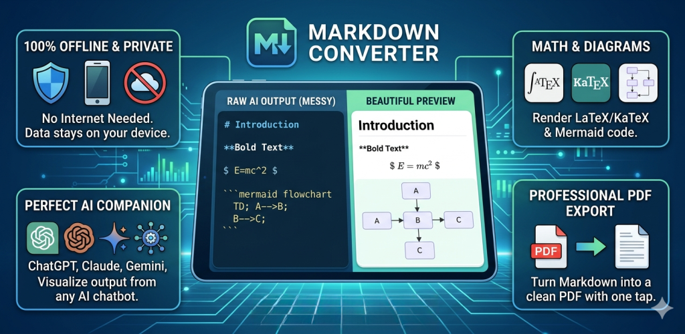
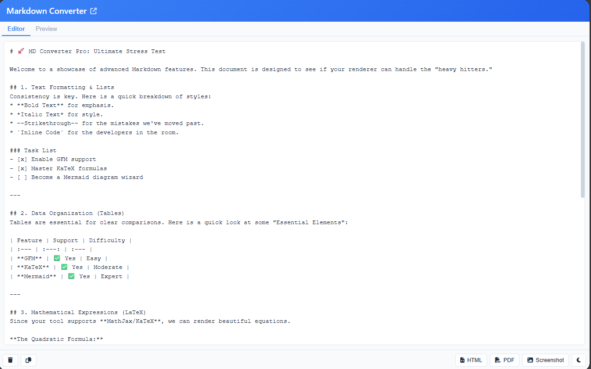
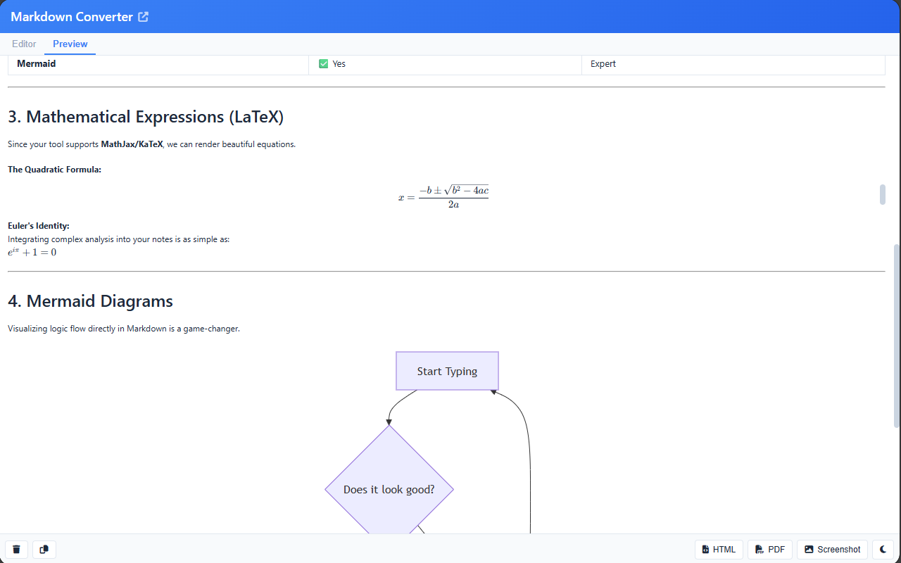
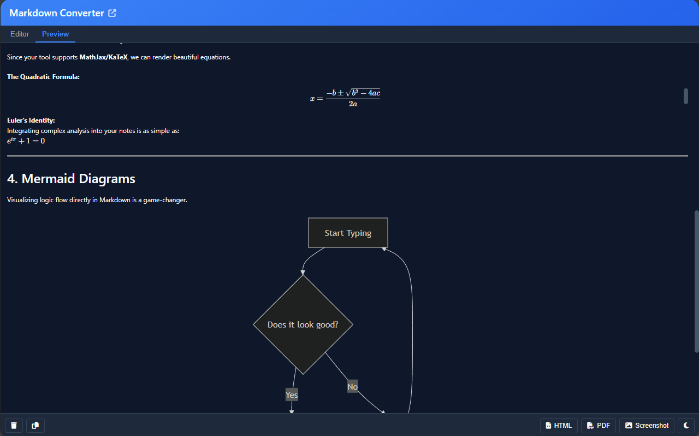
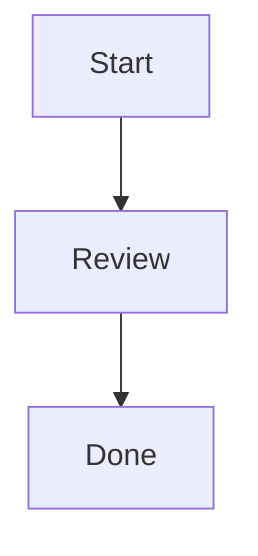

# Markdown Converter



Markdown Converter is a locally running browser extension that provides live Markdown preview, HTML/PDF export, PNG screenshots, Mermaid diagram rendering, and KaTeX math rendering for Chrome and Firefox.

## Features

- Live Markdown preview
- GitHub Flavored Markdown support
- Mermaid diagrams and KaTeX math
- HTML export, PDF export, and PNG screenshots
- Light and dark themes
- Local autosave
- One repository, two build outputs: `dist/chrome` and `dist/firefox`

| | | |
|---|---|---|
|  |  |  |

Chrome and Firefox both use a single side panel/sidebar UI. Clicking the toolbar icon opens that panel.

## Quick Start

### Build

```bash
npm run build
```

Other commands:

```bash
npm run build:chrome
npm run build:firefox
npm run clean
```

### Package for Distribution

Requires [web-ext](https://extensionworkshop.com/documentation/develop/getting-started-with-web-ext/) (install once globally):

```bash
npm install -g web-ext
```

Package Chrome:

```bash
npm run build:chrome
cd dist/chrome
web-ext build --overwrite-dest --artifacts-dir ../../release/chrome
```

Package Firefox:

```bash
npm run build:firefox
cd dist/firefox
web-ext build --overwrite-dest --artifacts-dir ../../release/firefox
```

Output files are placed in `release/chrome/` and `release/firefox/` respectively.

### Load The Extension

Chrome:

1. Open `chrome://extensions`
2. Enable Developer mode
3. Click “Load unpacked”
4. Select `dist/chrome`
5. Click the extension icon in the toolbar to open the side panel UI

Firefox:

1. Open `about:debugging#/runtime/this-firefox`
2. Click “Load Temporary Add-on”
3. Select `dist/firefox/manifest.json`
4. Click the extension icon in the toolbar to open the sidebar UI

## Example Markdown

````markdown
# Markdown Converter

This is **bold** text and this is `inline code`.

- item 1
- item 2

| Name | Value |
|------|-------|
| Foo  | Bar   |

```javascript
console.log('hello');
```



Inline math: $E = mc^2$

$$
\int_0^1 x^2 dx = \frac{1}{3}
$$
````

## Export Behavior

- `Copy HTML`: copies generated HTML
- `HTML`: downloads a standalone `.html` file
- `PDF`: opens the browser print flow for PDF export
- `Screenshot`: downloads a `.png` image
- `Clear`: clears editor content after confirmation

Screenshot sizing differs by browser surface on purpose: Chrome side panel uses a `640px` minimum width, Firefox sidebar uses `320px` to fit the narrower container.

## Project Structure

```text
markdownconverter/
├── manifest.json
├── manifest-firefox.json
├── sidebar.html
├── sidebar.js
├── styles.css
├── styles-sidebar.css
├── markdown-converter-core.js
├── screenshot-utils.js
├── background.js
├── libs/
├── images/
└── scripts/build.js
```

## Development

- Edit `markdown-converter-core.js` for shared behavior
- Edit `sidebar.js` only for browser-specific runtime differences
- Edit `background.js` for shared background behavior
- Rebuild with `npm run build` after changes

The repository already includes local runtime assets in `libs/` and `images/`, so no setup script or CDN swap is required.

## Troubleshooting

- Build fails: make sure Node.js is installed and run commands from the project root
- Chrome cannot load: check `dist/chrome/manifest.json`
- Firefox cannot load: check `dist/firefox/manifest.json` and use Firefox 140+
- Preview does not render: verify the files in `libs/` exist and inspect the extension console

## Notes

- License: MIT, see `LICENSE`
- Before publishing publicly, fill in the real `repository`, `author`, and issue tracker metadata in `package.json`

Version: `1.0.0`
Updated: `2026-03-28`
Compatibility: `Chrome 90+`, `Firefox 140+`
